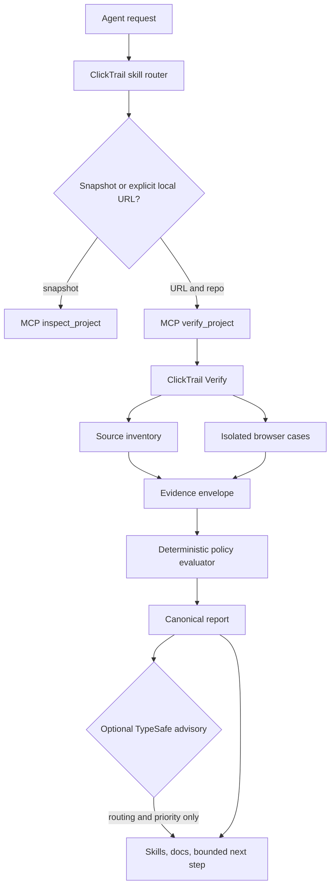

# ClickTrail evidence architecture

## Purpose

ClickTrail Verify is the factual boundary for a ClickTrail audit. It collects
source and browser observations, applies deterministic checks, and writes a
report that an agent can inspect without treating generated code or a local
request as provider proof.

The system has four separate responsibilities:

| Component | Owns | Does not own |
| --- | --- | --- |
| `clicktrail-js` | Browser/server event and attribution contracts | Audit conclusions |
| `clicktrail-verify` | Evidence collection, deterministic findings, report schema | Agent routing or provider delivery |
| `clicktrail-mcp` | MCP transport and local Verify orchestration | Factual overrides or external writes |
| `clicktrail-skills` | Problem routing and remediation guidance | Runtime evidence or acceptance claims |
| TypeSafe System One | Optional semantic routing and prioritization | PASS, FAIL, UNKNOWN, consent, or delivery decisions |

## Flow

The safe default uses no forms, CRM writes, provider APIs, or browser sandbox
disabling. A failed navigation or missing positive control is `UNKNOWN`, not a
pass or a client-specific failure.

## Evidence envelope

New reports contain an `evidence` object with schema `1.0.0`. It contains:

- `observations`: redacted facts such as case labels, status codes, counts, and
  safe relative paths;
- `findings`: deterministic results with `evidenceRefs`;
- `advisory`: an explicit `not-run` placeholder until an optional advisor runs;
- `producer`: `clicktrail-verify`.

`PASS`, `FAIL`, `WARN`, `NOT_RUN`, and `UNKNOWN` remain factual report states.
An evidence reference identifies an observation. It is not a cryptographic
claim and it does not prove a provider accepted a conversion.

The top-level report schema is `0.3.0`. The legacy `0.2.0` reports remain useful
historical artifacts, but they do not contain the new evidence envelope.

## Trust boundaries

1. **Input boundary:** contracts are declarative names and paths. They cannot
   contain executable selectors or adapters.
2. **Source boundary:** inventory records filenames and signal categories. It
   does not inspect `.env*` files or infer runtime behavior from regex matches.
3. **Browser boundary:** each case uses an isolated context. Cookies, storage
   values, request bodies, headers, identities, and secrets are not written to
   the report.
4. **Evaluation boundary:** deterministic code owns status and threshold logic.
   Provider activity is an observation; provider acceptance needs an independent
   receipt and remains outside the default runner.
5. **Advice boundary:** TypeSafe receives bounded finding summaries only. Its
   answer can select a skill or rank work, but cannot mutate a finding.

## Integration contract

`clicktrail-mcp.verify_project` invokes the locally configured
`clicktrail-verify` executable with `shell: false`, a temporary declarative
contract, and a temporary report directory. The tool accepts only absolute
repository paths and HTTP(S) URLs. It validates the returned `0.3.0` report and
its evidence references before returning it.

Snapshot-only MCP tools remain available for hosts that do not want local file
or browser access. They must not be described as equivalent to a Verify run.

## TypeSafe advisory

The optional advisor uses one System One request with independent questions:

- `Choice`: select the narrowest next skill;
- `Score`: rank repair urgency using a documented rubric;
- `Noul`: estimate whether human review is needed.

The state contains finding IDs, statuses, owners, evidence-reference counts,
and an allowlisted skill catalog. It excludes source text, URLs with query
values, cookies, request bodies, credentials, and PII. If TypeSafe is absent,
MCP returns a deterministic advisory fallback. Fallback and TypeSafe advice are
never used to change factual findings.

## Verification

- Run `npm test` and `npm run typecheck` in this repository.
- Generate a report against a local synthetic fixture and validate
  `schemas/report.schema.json` plus the evidence reference checks.
- Run MCP tests with no TypeSafe key and with a mocked TypeSafe response.
- Confirm direct Verify and MCP Verify return the same findings and evidence
  authority.
